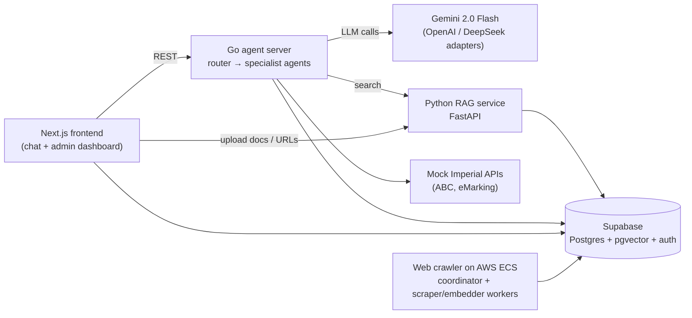

# SEGP: LLM Pastoral Tutor

An LLM-powered pastoral support assistant for Imperial College London Computing students. Students ask a chatbot about anything from coursework deadlines to wellbeing, and a team of specialist agents answers using the university's own documents and student data. Personal tutors and admins get a dashboard to manage the knowledge base, configure the agents and review feedback.

Built by a team of six as the third-year Software Engineering Group Project (SEGP) at Imperial, January to March 2025.

## What it does

- **Chat assistant for students.** A router LLM reads each question (with the chat history) and hands it to the most suitable specialist agent: academic support, admin and university services, careers, wellbeing, finance and accommodation, campus life, disability and accessibility, or transition and diversity. The UI shows each agent's progress as live "thinking" statuses.
- **Grounded answers.** Agents can search a RAG knowledge base built from university handbooks, policies and web pages, plus Google search, and are given the student's context from (mocked) Imperial APIs: modules, deadlines, marks, personal tutor, exam details and so on.
- **Retrieval-augmented generation (RAG) pipeline.** Documents (PDF, DOCX, PPTX, TXT) and web pages are converted to text, chunked, embedded with `BAAI/bge-small-en-v1.5` and stored in Supabase pgvector. Emails, phone numbers and URLs are extracted with their surrounding context, so agents can point students to the right contact.
- **Scalable web crawler.** A Redis-coordinated fleet of Go scraper and embedding workers on AWS ECS, autoscaled on queue depth, ingests whole sites into the knowledge base.
- **Tutor/admin dashboard.** Upload and manage RAG documents and URLs, edit agent prompts, descriptions and tools, browse agent events and requests, review liked and disliked responses, and let personal tutors view their tutees' chats.
- **Background jobs.**
  - *Chat checker:* when a chat goes inactive, an LLM reviews it for explicit signs of distress and, if needed, emails the personal tutor a summary. It's implemented and tested, but switched off in `backend/agents/agents-main/main.go`.
  - *Prompt adjustment:* agent prompts can be refined automatically from user feedback. This can be toggled from the dashboard.

## Architecture



| Component | Path | Stack |
|---|---|---|
| Frontend | `frontend/` | Next.js 15, React 19, Vercel AI SDK, Tailwind, shadcn/ui, TanStack Query, Supabase Auth, Drizzle |
| Agent server | `backend/agents/agents-main/` | Go 1.23, Gemini / OpenAI / DeepSeek, go-rod (headless Chrome), Resend |
| RAG service | `backend/rag/` | Python 3.12, FastAPI, Hugging Face Transformers, PyMuPDF (`pymupdf4llm`), Selenium, Supabase |
| Web crawler | `backend/web-crawler/` | Go, Redis (ElastiCache), ONNX Runtime, Terraform (ECS, ECR, IAM, autoscaling Lambda) |

## Repository layout

```
backend/
  agents/agents-main/   Go agent server: router, agents, tools, LLM clients, jobs, storage, mocked Imperial APIs
  rag/                  Python RAG service: ingestion, chunking, embeddings, search endpoints
  web-crawler/          Distributed crawler: coordinator, worker nodes, Terraform infra
  simple-web-crawler/   Early single-process crawler prototype
frontend/               Next.js app: student chat, auth, admin/tutor dashboard
```

This repository combines the project's two original GitLab repositories (backend and frontend), with their full commit histories preserved.

## Running locally

You need your own Supabase project, a Gemini API key and (for the RAG service) Chrome for Selenium.

**Backend**

```bash
cd backend
cp .env.example .env        # fill in the API keys, Supabase URL/service key, RAG_BASE_URL, JWT secret

# RAG service (http://localhost:8000)
cd rag
python -m venv venv && source venv/bin/activate
pip install -r ../requirements.txt
python main.py

# Agent server (http://localhost:8080), in a second terminal
cd backend
./run-agents-server.sh
```

**Frontend**

```bash
cd frontend
pnpm install
# create .env.local with NEXT_PUBLIC_SUPABASE_URL, NEXT_PUBLIC_SUPABASE_ANON_KEY,
# NEXT_PUBLIC_BACKEND_AGENT_URL (e.g. http://localhost:8080) and NEXT_PUBLIC_BACKEND_RAG_URL (e.g. http://localhost:8000)
pnpm dev
```

**Web crawler embedding model.** The worker nodes expect `backend/web-crawler/worker-node/model/model.onnx`, which is too large for GitHub and has been removed from this repository's history. Download the ONNX export of [`BAAI/bge-small-en-v1.5`](https://huggingface.co/BAAI/bge-small-en-v1.5) (`onnx/model.onnx`) and place it there. The tokenizer files are already included.

## My contributions (Alex Slater)

- **RAG service:** built most of the Python service. It covers document ingestion for PDF, DOCX, PPTX and TXT, token-aware chunking with overlap, embeddings, and vector search via Supabase RPC. It also covers extracting emails, phone numbers and URLs with context and returning them alongside search results, PDF-to-Markdown extraction, URL ragging with headless Chrome, and the FastAPI endpoints for uploading, listing, downloading and deleting sources. Chunk and contact retrieval run concurrently.
- **Knowledge-base admin UI:** document library and upload pages, URL ragging / web-scraper page with bulk upload, all wired to the RAG service.
- **Authentication:** initial Supabase Auth setup in the frontend (client, server and middleware, plus sign-in, sign-up and email confirmation).
- **Agents:** designed and tuned the finance and accommodation and the campus life agents, refined the academic support and admin services agents to act more like a personal tutor, and extended the mocked Imperial API data they rely on (PhD, pastoral care, registration dates, enrolled modules).
- **Chat checker job:** the background job that detects inactive chats, uses LLM structured output to flag signs of distress, and emails the personal tutor, along with its tests.

## Team

Ethan Hosier · Anshul Sendil · Dillan Scott · Angelo Sparacino · Teo Hughes · Alex Slater

The frontend began from Vercel's [AI Chatbot template](https://github.com/vercel/ai-chatbot) (Apache 2.0, see `frontend/LICENSE`).
